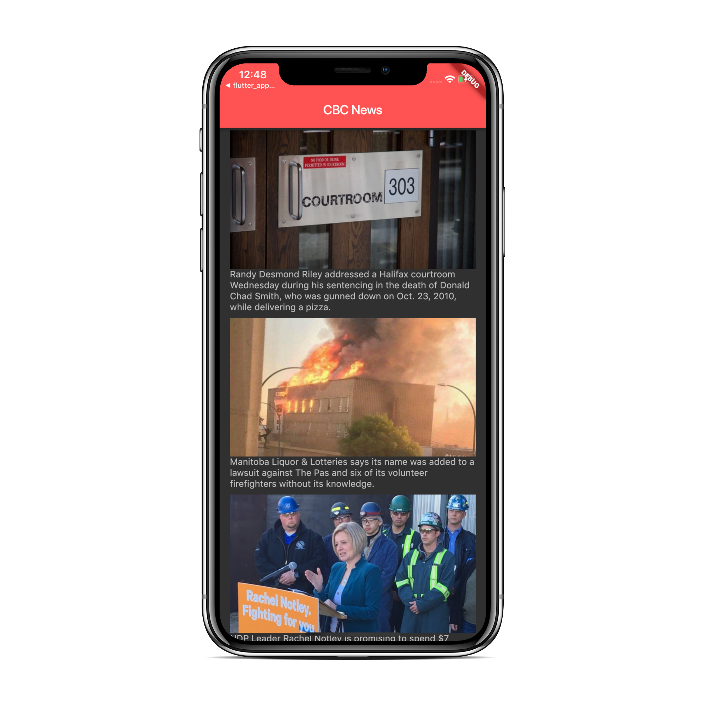

# CBC News Reader

This is an open source clone of CBC News Reader application developed with the Flutter Framework.

  

# Build beautiful native apps in record time

Flutter is Google’s mobile app SDK for crafting high-quality native interfaces on iOS and Android in record time. Flutter works with existing code, is used by developers and organizations around the world, and is free and open source.

### Documentation

**Main site: [flutter.dev][]**
* [Install](https://flutter.dev/get-started/install/)
* [Get started](https://flutter.dev/get-started/)
* [API documentation](https://docs.flutter.dev/)
* [Changelog](https://github.com/flutter/flutter/wiki/Changelog)
* [How to contribute](https://github.com/flutter/flutter/blob/master/CONTRIBUTING.md)

## Getting Started

This project is a starting point for a Flutter application with the Restful API backend.

A few resources to get you started if this is your first Flutter project:

- [Lab: Write your first Flutter app](https://flutter.io/docs/get-started/codelab)
- [Cookbook: Useful Flutter samples](https://flutter.io/docs/cookbook)

For help getting started with Flutter, view our 
[online documentation](https://flutter.io/docs), which offers tutorials, 
samples, guidance on mobile development, and a full API reference.
